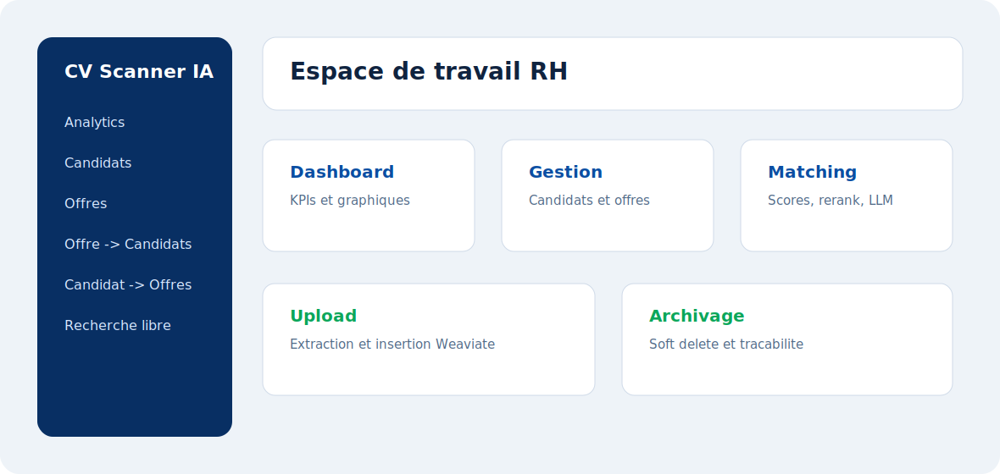

# Vue D'ensemble De L'Interface

L'interface Next.js est organisee autour d'une navigation laterale et de pages metier. Elle se concentre sur des workflows RH concrets : consulter, rechercher, uploader, matcher et archiver.

## Navigation

La sidebar donne acces aux modules :

- Analytics ;
- Gestion candidats ;
- Gestion offres ;
- Matching offre vers candidats ;
- Matching candidat vers offres ;
- Recherche libre.

## Composants Partages

Les composants communs reduisent la duplication :

| Composant | Role |
|---|---|
| `Topbar` | Affiche les KPIs globaux |
| `Sidebar` | Navigation principale |
| `UploadPanel` | Upload fichier ou lien |
| `SearchableSelect` | Selection avec recherche |
| `FilterPanel` | Parametres de matching et reranking |
| `DeleteConfirmModal` | Confirmation d'archivage |
| `Toast` | Notifications utilisateur |

## Principe UX

L'interface separe deux familles de besoins :

- **gestion** : pages Candidats et Offres ;
- **matching** : pages dediees au rapprochement CV/offres.

Cette separation rend l'application plus claire pour un utilisateur RH.
