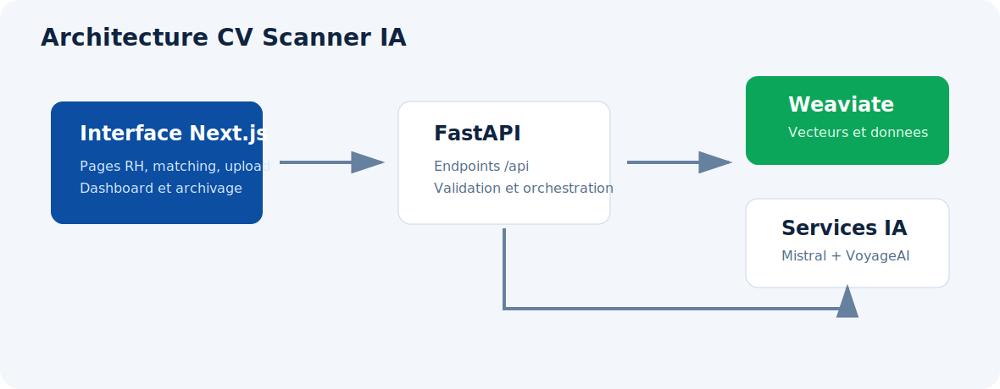

# Vue D'ensemble Du Projet

CV Scanner IA est une solution complete pour structurer, rechercher et comparer des profils candidats avec des offres d'emploi IT. Le projet couvre toute la chaine : ingestion de documents, extraction IA, validation, stockage vectoriel, matching et exploitation dans une application web.

## Enjeu Metier

Les equipes RH manipulent souvent des CV et des offres sous forme de fichiers ou de textes peu structures. Sans automatisation, la comparaison entre un besoin et une base de candidats demande beaucoup de lecture manuelle.

CV Scanner IA automatise cette analyse en transformant les documents en donnees exploitables, puis en calculant des correspondances entre candidats et offres selon plusieurs dimensions.

## Capacites Principales

- ajout de candidats et d'offres depuis fichiers ;
- extraction structuree avec Mistral ;
- controle des champs obligatoires avant insertion ;
- stockage dans Weaviate avec vecteurs nommes ;
- matching offre vers candidats ;
- matching candidat vers offres ;
- recherche avancee et recherche par criteres ;
- reranking VoyageAI ;
- analyse LLM d'un match ou d'un ecart ;
- dashboard de suivi ;
- archivage fonctionnel ;
- application web Next.js pour l'exploitation quotidienne.

## Composants Principaux

| Couche | Role | Fichiers principaux |
| --- | --- | --- |
| FastAPI | Exposition des endpoints HTTP | `API/main_api.py`, `API/CRUD_API.py`, `API/List_API.py`, `API/Search_API.py`, `API/Upload_API.py` |
| Extraction IA | Lecture fichier, prompt, extraction JSON, validation | `API/Upload_API.py` |
| Weaviate | Stockage objet + vecteurs nommes | `weaviate_db/setup_weaviate.py`, `weaviate_db/CRUD.py`, `weaviate_db/List.py` |
| Matching | Recherche texte, vectorielle et hybride | `weaviate_db/search/candidates_for_job.py`, `weaviate_db/search/jobs_for_candidate.py` |
| Application web | Interface Next.js de gestion et matching | `cv-scanner-godev/src/app`, `cv-scanner-godev/src/components`, `cv-scanner-godev/src/lib/api.ts` |

## Flux General

1. L'utilisateur ajoute ou consulte une donnee depuis l'application web.
2. L'application appelle les endpoints FastAPI.
3. Le backend extrait, valide ou recherche les donnees selon l'action demandee.
4. Weaviate stocke les objets et execute les recherches texte, vectorielles ou hybrides.
5. Les services IA interviennent pour l'extraction, le reranking ou l'explication.
6. Les resultats sont retournes a l'application web avec scores, details et UUID.

## Principes Techniques

- Le backend est la source de verite pour les validations.
- L'upload reutilise les endpoints CRUD afin d'eviter la duplication.
- Weaviate conserve les objets et les vecteurs nommes.
- Les modes `texte`, `vecteur` et `hybride` donnent plusieurs strategies de recherche.
- L'archivage est privilegie pour conserver la traçabilite.
- L'application web Next.js consomme l'API et presente les workflows metier.
