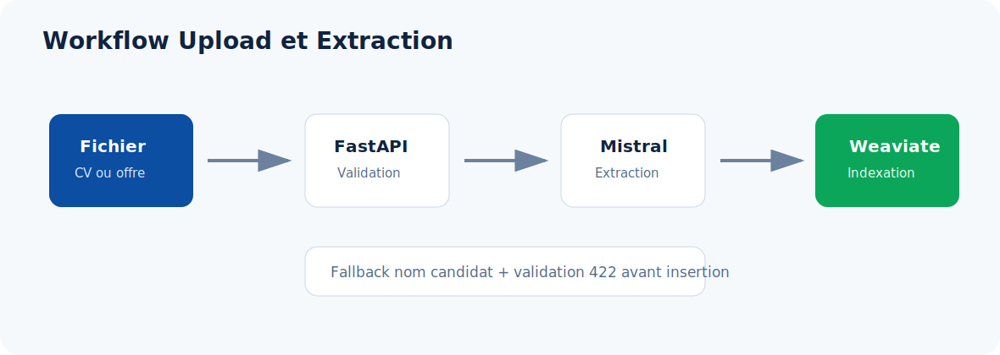

# Upload, Extraction Et Vectorisation



L'upload permet d'ajouter un candidat ou une offre depuis un fichier, puis de rendre ces donnees exploitables par le matching.

## Endpoints

| Endpoint | Methode | Role |
| --- | --- | --- |
| `/api/upload/candidate/file` | POST | Upload CV candidat |
| `/api/upload/job/file` | POST | Upload offre |
| `/api/upload/from-url` | POST | Extraction depuis URL publique |

## Pipeline CV

```text
Fichier CV
  -> extract_text_from_bytes
  -> extract_with_mistral_small
  -> validate_extracted_cv
  -> map_cv_to_payload
  -> add_candidate_endpoint
  -> add_candidate
  -> Weaviate Candidate
  -> vectorisation
```

La validation bloque l'insertion si le nom du candidat reste introuvable.

Le fallback `full_name` utilise les premieres lignes non vides du document pour recuperer un nom plausible lorsque le LLM retourne une valeur invalide.

## Pipeline Offre

```text
Fichier offre
  -> extract_text_from_bytes
  -> extract_with_mistral_small
  -> validate_extracted_job
  -> map_job_to_payload
  -> add_job_endpoint
  -> add_job
  -> Weaviate Job
  -> vectorisation
```

La validation bloque l'insertion si le titre de l'offre est absent.

## Pourquoi Reutiliser Le CRUD

L'upload appelle directement les endpoints CRUD existants :

```text
add_candidate_endpoint(payload)
add_job_endpoint(payload)
```

Ce choix evite de recreer la logique d'ajout dans le module upload. Il garantit aussi que les candidats et offres ajoutes par fichier suivent le meme chemin que les insertions JSON classiques.

## Vectorisation

La vectorisation est geree par Weaviate via les named vectors configures dans `weaviate_db/setup_weaviate.py`.

Lorsqu'un objet est insere :

- Weaviate lit les proprietes sources ;
- VoyageAI genere les embeddings ;
- les vecteurs sont stockes avec l'objet ;
- le matching peut utiliser les modes `vecteur` et `hybride`.

## Logs Utiles

Exemples de logs attendus :

```text
[Upload] full_name Mistral : ...
[Upload] full_name fallback : ...
[Upload] company_source Mistral : ...
[Upload] job title Mistral : ...
```

Ces logs permettent de verifier si l'information vient directement de Mistral ou d'un fallback backend.
